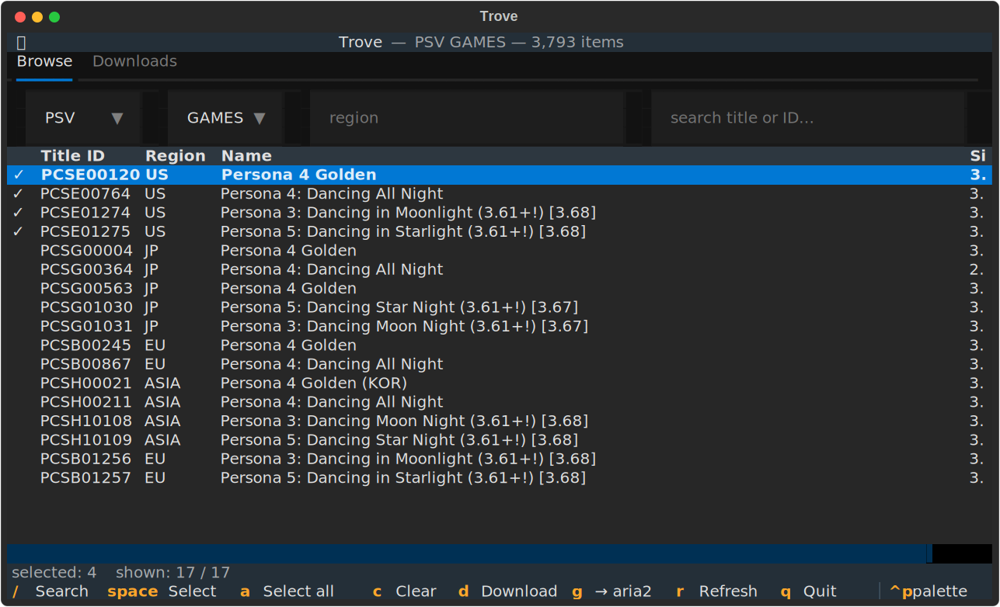
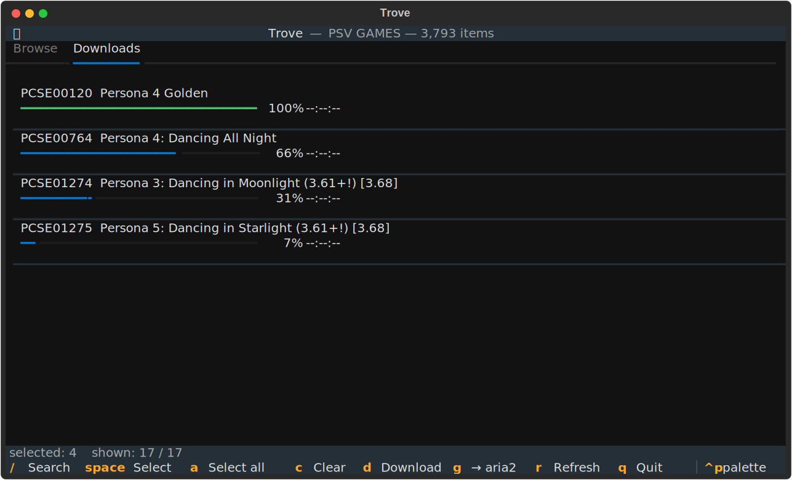

# Trove

A fast CLI and TUI for browsing and downloading the
[NoPayStation](https://nopaystation.com) catalog — PSV, PSP, PS3, PSX and PSM.
Downloads resume, retry, and verify SHA-256, or hand off to a running aria2.




## Install

From a clone, with [uv](https://docs.astral.sh/uv/):

```bash
uv sync                       # core
uv sync --extra monitoring    # + optional GlitchTip/Sentry error reporting
```

Once published to PyPI, `pip install trovenps` (distribution name `trovenps`)
will install the same `nps` and `trove` commands.

Two commands ship with the package:

- `nps` — the command-line interface (search, list, download).
- `trove` — the full-screen TUI.

## At a glance

```bash
nps "tearaway"                  # search PSV games
nps -p PS3 -t DLCS "persona"    # any platform / type
nps "PCSC80018" -o ./downloads  # download
trove                           # browse in the TUI
```

See [Usage](usage.md) for every flag, and [Scripting & agents](agents.md) for the
JSON output that scripts and AI agents consume.

Trove only retrieves what NoPayStation publishes; how you use it is on you.
