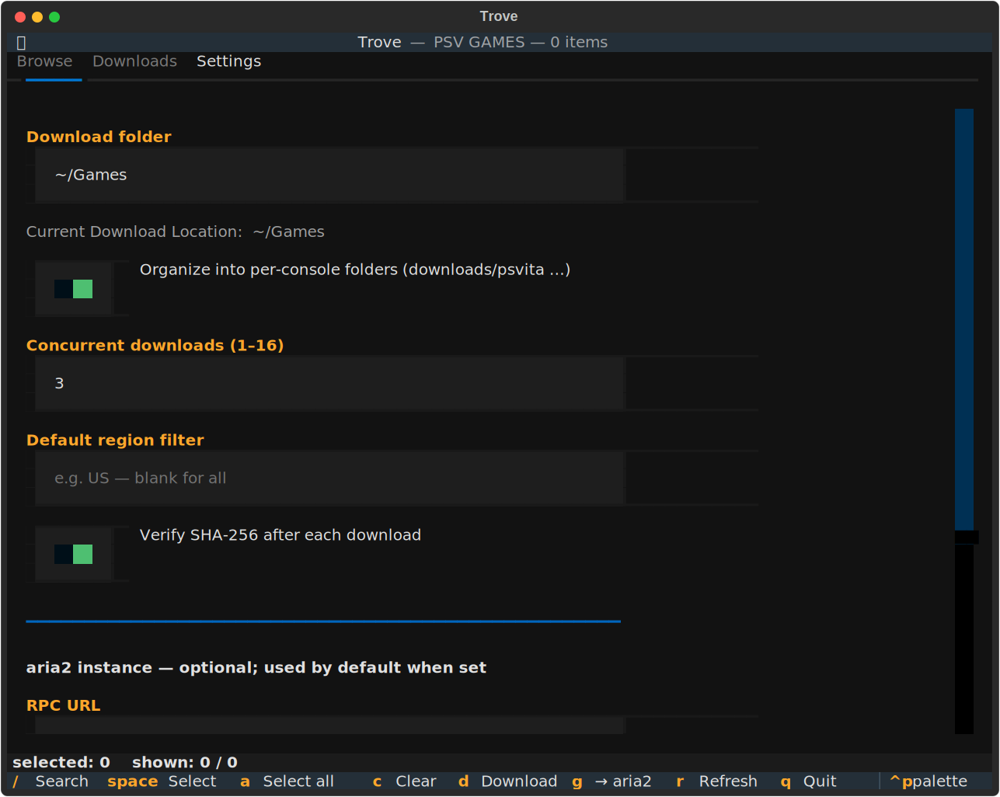

# Usage

## CLI (`nps`)

```bash
nps "tearaway"                               # search PSV games by name or Title ID
nps -p PS3 -t DLCS "persona"                 # pick platform and content type
nps "tearaway" --list                        # list matches, don't download
nps "PCSC80018" -o ./downloads               # download a single match
nps "patapon" -p PSP --all                   # download every downloadable match
nps "tearaway" --json                        # machine-readable output (see Agents)
```

### Options

| Flag | Meaning |
| --- | --- |
| `query` | Title ID or name, case-insensitive. |
| `-p, --platform` | `PSV` (default), `PSP`, `PS3`, `PSX`, `PSM`. |
| `-t, --type` | `GAMES` (default), `DLCS`, `THEMES`, `UPDATES`, `DEMOS`, `AVATARS`. |
| `-r, --region` | Region to include, repeatable (e.g. `-r US -r EU`). |
| `--name` | Match a name substring only (vs the combined `query`). |
| `--title-id` | Match a Title ID substring only. |
| `--max-fw` | Only items requiring firmware ≤ this version (e.g. `3.60`). |
| `--min-size` / `--max-size` | Bound size; accepts `100MB`, `2GB`, or raw bytes. |
| `-o, --output` | Output directory (default: saved `download_dir`, else `./downloads`). |
| `--flat` | Don't split downloads into per-console subfolders. |
| `--local` | Force the built-in downloader even if an aria2 instance is configured. |
| `-l, --list` | List matches without downloading. |
| `-a, --all` | Download every downloadable match. |
| `--json` | Print matches as JSON; no download. |
| `-c, --concurrency` | Max concurrent downloads (default: saved value, else 3). |
| `--no-verify` | Skip SHA-256 verification. |
| `--refresh` | Force-refresh the catalog from NoPayStation. |
| `--reset-cache` | Delete all cached catalogs and exit. |
| `--offline` | Use only the cached catalog (no network). |

NoPayStation doesn't publish every platform × type combination; unavailable
combinations return nothing.

### Where files go

Downloads are split by console so a mixed batch stays tidy:

```text
downloads/
  psvita/  psp/  ps3/  psx/  psm/
```

Pass `--flat` (or turn off the toggle in Settings) for a single folder. The base
folder comes from `-o`, else your saved `download_dir`, else `./downloads`.

### Shared settings

The CLI reads the same `settings.json` the TUI writes, so saved values become
defaults — `download_dir`, `concurrency`, `verify`, a default region, the
per-console toggle, and an aria2 instance. Precedence is **explicit flag > env
var > settings > built-in default**. In particular, if you save an aria2 URL,
plain `nps "game"` routes to it automatically (use `--local` to override).

### Filtering

Flags combine, so you can narrow a list before browsing or downloading:

```bash
nps "" --max-fw 3.60                    # everything that runs on firmware <= 3.60
nps "persona" -p PS3 --max-size 2GB     # skip the huge ones
nps --max-fw 3.65 --min-size 100MB --json
```

`--max-fw` is the firmware-compatibility filter homebrew users want: it keeps only
items whose required firmware is at or below the version you give. Items with an
**unknown** required firmware are excluded, not assumed safe. `required_fw` is also
in the `--json` output, so an agent can filter on it too.

## TUI (`trove`)

```bash
trove
```

Search, multi-select (selections survive searches), and download with live
progress or aria2 hand-off. Press `/` to focus search; the result table keeps
the action keys (download, select) live while you browse.

The **Downloads** tab shows where files are being saved, plus a live speed and
size for each transfer:


### Settings

The **Settings** tab saves your download folder, the per-console organize toggle,
concurrency, SHA-256 verification, a default region filter, and an optional aria2
instance (RPC URL / secret / remote dir). The current resolved download location
shows live under the folder field. Everything applies immediately and persists to
`settings.json` in your OS config directory (`~/.config/trovenps` on Linux;
override with `NPS_CONFIG_DIR`) — the same file the CLI reads.



## aria2 hand-off

Use [aria2](https://aria2.github.io/) as the download engine instead of the
built-in downloader. The simplest form is one command — it needs `aria2c` on
your PATH:

```bash
nps "patapon" -p PSP --all --aria2-run            # download now via local aria2c
```

Or export an input file and run aria2c yourself:

```bash
nps "patapon" -p PSP --all --aria2 patapon.txt
aria2c -c -j3 -i patapon.txt
```

Or push to a running aria2 daemon over RPC:

```bash
nps "patapon" -p PSP --all \
  --aria2-rpc http://localhost:6800/jsonrpc \
  --aria2-secret TOKEN
```

`--aria2-rpc` and `--aria2-secret` fall back to `ARIA2_RPC_URL` /
`ARIA2_RPC_SECRET`, then to a saved aria2 instance (so once it's in Settings you
can drop the flags entirely). Use `--aria2-dir` for the download directory on the
aria2 host. All three carry over the embedded SHA-256 checksums and the
per-console subfolders.

## Caching & configuration

- Catalogs come from NoPayStation and are cached for 30 days, then revalidated
  with an ETag (an unchanged dataset costs a `304`, not a refetch).
- The cache lives in the OS cache directory; set `NPS_CACHE_DIR` to relocate it.
- Optional error reporting goes to GlitchTip/Sentry via `GLITCHTIP_DSN` (install
  the `monitoring` extra).
